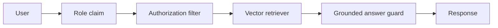

# Role-Based RAG System

A retrieval-augmented internal chatbot boundary with role-based document filtering and a deny-by-default answer policy. The MVP keeps retrieval deterministic; ChromaDB and LangChain adapters can replace the in-memory retriever.

Run `pip install -r requirements.txt` and `uvicorn app.main:app --reload`. Send `POST /query` with header `X-Role: engineering` or `X-Role: finance`.
